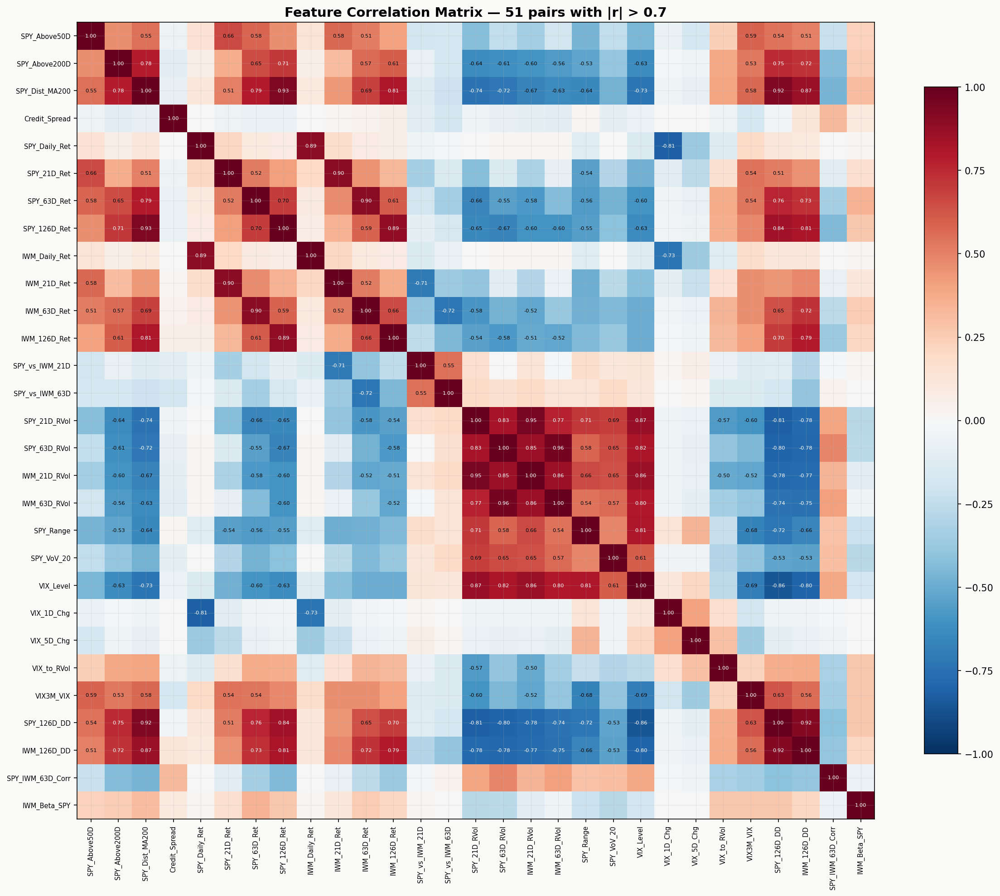
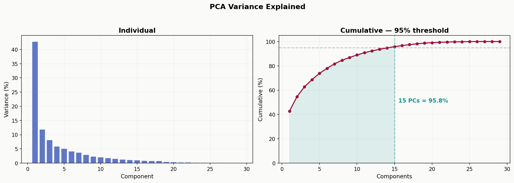
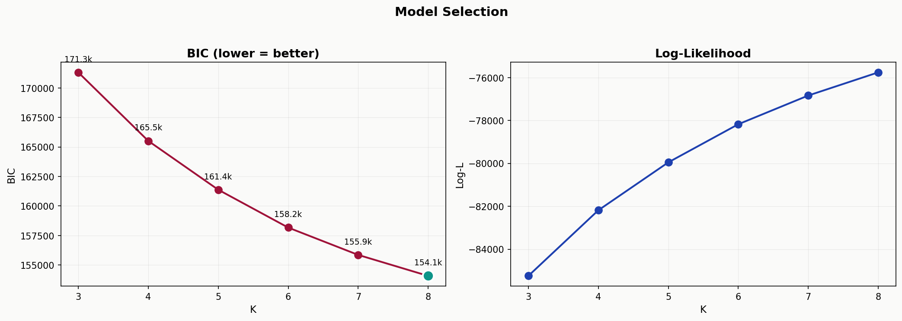
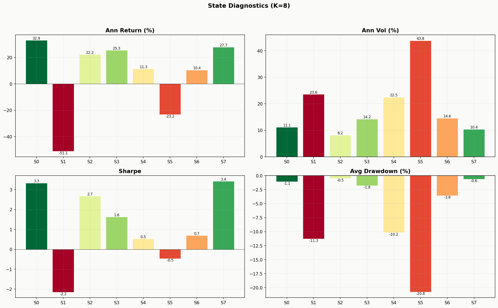
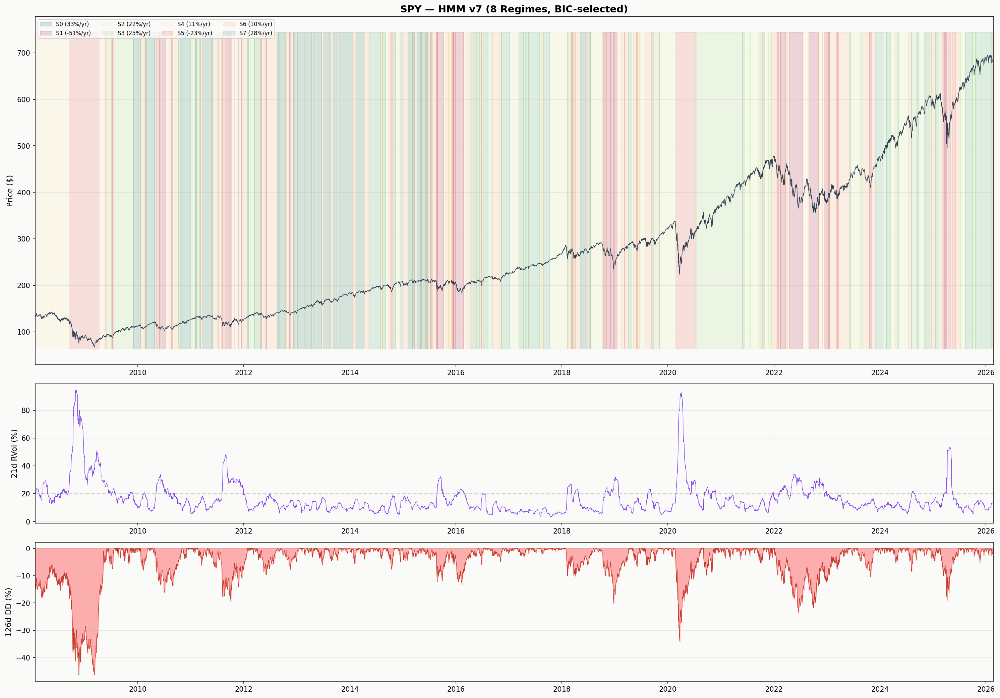

# Detecting Market Regimes with a Multi-Feature Hidden Markov Model

## Hidden Markov Model

A Hidden Markov Model (HMM) is a statistical model for sequential data where the system being modeled is assumed to follow a Markov process with unobservable (hidden) states. The key idea: we cannot directly see the state the system is in, but we can observe data that the state generates. The model learns both the transition dynamics between states and the statistical signature of each state from the observed data alone.

HMMs were developed in the late 1960s by Leonard Baum and collaborators for speech recognition — the hidden states were phonemes (which you cannot see), and the observations were acoustic signals (which you can measure). Since then, HMMs have been applied across a wide range of domains: gene sequence analysis in bioinformatics, part-of-speech tagging in natural language processing, gesture recognition in computer vision, and regime detection in financial markets.

In this project, the hidden states represent market regimes, persistent periods where returns, volatility, and cross-asset dynamics behave in a statistically distinct way. Bull markets, bear markets, crisis episodes, and sideways consolidations are all examples of regimes. We never observe the regime directly; we only observe its consequences through prices, spreads, and volatility. The HMM formalizes this intuition and provides a probabilistic framework to infer which regime we are in at any point in time.

---

## Introduction

A Gaussian Hidden Markov Model assumes that observable market data is generated by a latent state process, that I will call the "regime". That transitions between $K$ discrete states according to a first-order Markov chain.Each state $k$ emits observations from its own multivariate normal distribution $\mathcal{N}(\boldsymbol{\mu}_k, \boldsymbol{\Sigma}_k)$. 

The model parameters are estimated via the Baum-Welch algorithm (EM), and the number of states is selected by minimizing the Bayesian Information Criterion (BIC).

---

## The Start

```python
import warnings; warnings.filterwarnings('ignore')
import os, json, numpy as np, pandas as pd, yfinance as yf
import matplotlib; matplotlib.use('Agg')
import matplotlib.pyplot as plt
from sklearn.preprocessing import StandardScaler
from sklearn.decomposition import PCA
from hmmlearn.hmm import GaussianHMM

OUT = 'C:/Users/UsuarioHP/Desktop/hmm_output'
TICKERS = ['SPY','IWM','HYG','LQD']
K_RANGE = range(3,9)   # BIC will select from K=3..8
SEEDS = 5              # random restarts per K (EM finds local optima)
```

`hmmlearn` provides the Gaussian HMM implementation with EM training. `sklearn` handles standardization and PCA. Financial literature and similar repositories suggest markets exhibit 3–8 distinct behavioral modes.I use BIC as it penalizes unnecessary complexity.After several attempts in which I have implemented a large number of variables, I found, as is usually the case, that the laxity of variables increases the predictive power; below I explain why I have chosen these variables.

---

## Step 1 — Data Collection

```python
def collect():
    etf = yf.download(TICKERS, start='2005-01-01', auto_adjust=False, progress=False)
    cl, hi, lo = etf['Close'], etf['High'], etf['Low']

    vix   = yf.download('^VIX',   start='2005-01-01', auto_adjust=True, progress=False)['Close']
    vix3m = yf.download('^VIX3M', start='2005-01-01', auto_adjust=True, progress=False)['Close']

    df = pd.DataFrame(index=cl.index)
    df['SPY'], df['SPY_High'], df['SPY_Low'] = cl['SPY'], hi['SPY'], lo['SPY']
    df['IWM'], df['HYG'], df['LQD'] = cl['IWM'], cl['HYG'], cl['LQD']
    df['VIX'], df['VIX3M'] = vix, vix3m
    df = df.ffill(limit=3).dropna()
    return df
```

Six data sources, each capturing a different dimension of the market:

- **SPY (S&P 500 ETF)**  Most regime detection studies start here because the S&P 500 is the most liquid, most watched, and most representative equity index in the world, it provides the primary signal for market direction and volatility.

- **IWM (Russell 2000 ETF)** Small-cap equities are more cyclically sensitive than large caps. During risk-on environments, small caps tend to outperform. During stress, they underperform and exhibit higher volatility. This divergence between SPY and IWM is itself a regime signal, when large caps lead small caps, it often indicates defensive institutional rotation.

- **HYG (High Yield Corporate Bond ETF)** When credit conditions deteriorate, HYG drops before equities do, making it a leading indicator of stress. I do not use HYG in isolation, I pair it with LQD to construct a credit spread proxy.

- **LQD (Investment Grade Corporate Bond ETF)** LQD serves as for credit risk measurement. The feature is log(HYG) − log(LQD), which isolates the credit risk premium from interest rate movements. When this spread compresses, markets are calm. When it widens, investors are demanding more compensation for default risk.

- **VIX (CBOE 30-Day Volatility Index)** VIX reflects option-implied expectations of future volatility.

- **VIX3M (CBOE 3-Month Volatility Index)** Used in combination with VIX to construct the volatility term structure ratio (VIX3M/VIX). In calm markets this ratio exceeds 1.0 (contango ). During acute stress it drops below 1.0 (backwardation ). This single ratio compresses the entire vol term structure into one number.

HYG inception (April 2007) is the binding constraint on sample start date — all other series have longer histories. After aligning all six sources to common trading dates, forward-filling minor gaps, and dropping remaining NaN: 4,550 daily observations spanning January 2008 through February 2026.

---

## Step 2 — Feature Engineering

I construct 29 features spanning seven categories. Each feature should have a different distribution under different market regimes.

```python
def features(df):
    f = pd.DataFrame(index=df.index)
    sr, ir = df['SPY'].pct_change(), df['IWM'].pct_change()
    rv = lambda s,w: s.rolling(w).std() * np.sqrt(252)

    # Trend (3): MA flags + distance from 200d MA
    f['SPY_Above50D']  = (df['SPY'] > df['SPY'].rolling(50).mean()).astype(int)
    f['SPY_Above200D'] = (df['SPY'] > df['SPY'].rolling(200).mean()).astype(int)
    f['SPY_Dist_MA200'] = df['SPY'] / df['SPY'].rolling(200).mean() - 1

    # Credit (1): log price ratio isolates spread changes
    f['Credit_Spread'] = np.log(df['HYG']) - np.log(df['LQD'])

    # Multi-horizon returns (8): daily, 21d, 63d, 126d for SPY + IWM
    for t, r, n in [('SPY',sr,'SPY'), ('IWM',ir,'IWM')]:
        f[f'{n}_Daily_Ret']=r; f[f'{n}_21D_Ret']=df[t].pct_change(21)
        f[f'{n}_63D_Ret']=df[t].pct_change(63); f[f'{n}_126D_Ret']=df[t].pct_change(126)

    # Relative performance (2): large vs small cap
    f['SPY_vs_IWM_21D'] = f['SPY_21D_Ret'] - f['IWM_21D_Ret']
    f['SPY_vs_IWM_63D'] = f['SPY_63D_Ret'] - f['IWM_63D_Ret']

    # Realized vol (4): annualized rolling vol at 21d and 63d
    f['SPY_21D_RVol']=rv(sr,21); f['SPY_63D_RVol']=rv(sr,63)
    f['IWM_21D_RVol']=rv(ir,21); f['IWM_63D_RVol']=rv(ir,63)

    # Microstructure (2): intraday range + vol-of-vol
    f['SPY_Range']  = (df['SPY_High'] - df['SPY_Low']) / df['SPY']
    f['SPY_VoV_20'] = f['SPY_21D_RVol'].rolling(20).std()

    # VIX (5): level, Chng 1d, Chng 5d, implied/realized ratio, term structure
    f['VIX_Level']=df['VIX']; f['VIX_1D_Chg']=df['VIX'].diff(1); f['VIX_5D_Chg']=df['VIX'].diff(5)
    f['VIX_to_RVol'] = df['VIX'] / (f['SPY_21D_RVol'] * 100)
    f['VIX3M_VIX']   = df['VIX3M'] / df['VIX']

    # Drawdowns (2): distance from 126d high
    f['SPY_126D_DD'] = df['SPY'] / df['SPY'].rolling(126, min_periods=1).max() - 1
    f['IWM_126D_DD'] = df['IWM'] / df['IWM'].rolling(126, min_periods=1).max() - 1

    # Cross-asset (2): rolling correlation and beta
    f['SPY_IWM_63D_Corr'] = sr.rolling(63).corr(ir)
    f['IWM_Beta_SPY'] = sr.rolling(63).cov(ir) / sr.rolling(63).var()

    return f.dropna()
```

**Multi-horizon returns** (daily through 126d) let the model distinguish fast shocks from sustained trends.

**Intraday range** $(H - L)/C$ captures within-day stress that close-to-close returns miss. 

**Vol-of-vol** measures whether volatility itself is unstable — a precursor to regime transitions.

**VIX3M/VIX** exposes the volatility term structure: contango (> 1) = calm, backwardation (< 1) = stress. 

**Credit spread** as log(HYG) − log(LQD) gives a daily tradeable proxy for credit risk.

> **Output:** 29 features × 4,547 observations (Jan 2008 – Feb 2026).

---

## Step 3 — PCA

Each component is a linear combination of the original features, constructed to capture the maximum possible variance in the data. The first component captures the most variance, the second captures the most of what remains (orthogonal to the first), and so on.
In this pipeline, I use PCA for a more practical reason: to make the HMM behave better. It reduces dimensionality, removes redundancy, and gives the model a cleaner input space so regime detection is more stable and less noisy.

Many of the 29 features are correlated. Realized volatility and VIX move together (r = 0.87). Multi-horizon returns overlap mechanically (SPY_63D_Ret and SPY_126D_Ret share 63 days of data). Credit spread and drawdown both spike during crises. In total, 51 feature pairs have r > 0.7.



This creates a problem for the HMM. In order to solve it,I have to use diagonal covariance  because it requires far fewer parameters than full covariance, fewer parameters means more stable estimation with finite data. But diagonal covariance assumes the features are uncorrelated given the state. Feeding in 29 correlated features violates this assumption and produces degenerate states where the model overfits to spurious correlation patterns.....

PCA solves this exactly. After transforming the features into principal components, the correlations are zero by construction and diagonal covariance becomes mathematically appropriate. In fact, fitting a diagonal-covariance HMM in PCA space is equivalent to fitting a full-covariance HMM in the original feature space, but with far fewer parameters. For K = 8 states and d = 15 components, this means 240 emission parameters instead of 960.

Standardize all 29 features to zero mean and unit variance first (otherwise high-variance features like VIX_Level would dominate the decomposition), then retain enough components to explain 95.8% of total variance:

```python
def do_pca(feat, target=0.95):
    X = feat.replace([np.inf, -np.inf], np.nan).dropna()
    sc = StandardScaler()
    Xs = sc.fit_transform(X.values)        # z-score: (x - μ) / σ

    pca = PCA()
    Xp = pca.fit_transform(Xs)             # eigendecomposition of cov matrix

    n = np.argmax(np.cumsum(pca.explained_variance_ratio_) >= target) + 1
    return Xp[:, :n], X.index, Xs, pca, n, X.columns
```



*15 components capture 95.8% of variance. The remaining 14 contribute noise.*

Since PCA components are uncorrelated by construction, diagonal covariance in PCA space is equivalent to full covariance in raw feature space — but with $K \times 2d$ parameters instead of $K \times d(d+1)/2$. For $K = 8$, $d = 15$: 240 emission parameters vs. 960.

---

## Step 4 — HMM Fitting and BIC Selection

We fit a Gaussian HMM for each candidate $K$ and select by BIC:

$$\text{BIC}(K) = -2 \ln L_K + p_K \ln T$$

where $p_K = (K-1) + K(K-1) + 2Kd$ counts the free parameters, $L_K$ is the maximized likelihood, and $T$ is the sample size.

```python
def fit_hmm(X):
    T, d = X.shape

    def bic(m, X):
        K = m.n_components; logL = m.score(X)
        p = (K-1) + K*(K-1) + K*2*d
        return -2*logL + p*np.log(T), logL

    res = []; best = {'bic': np.inf}
    for K in K_RANGE:
        bk = {'bic': np.inf}
        for s in range(SEEDS):             # multiple restarts (EM → local optima)
            m = GaussianHMM(n_components=K, covariance_type='diag',
                            n_iter=1000, random_state=42+s)
            m.fit(X)
            b, l = bic(m, X)
            if b < bk['bic']: bk = {'bic':b, 'm':m, 'logL':l}
        res.append((K, bk['bic'], bk['logL']))
        if bk['bic'] < best['bic']: best = bk
    return best['m'], best['m'].predict(X), res
```



| K | BIC | log L | Parameters |
|---|-----|-------|------------|
| 3 | 171,316 | −85,245 | 98 |
| 4 | 165,511 | −82,187 | 135 |
| 5 | 161,374 | −79,954 | 174 |
| 6 | 158,167 | −78,178 | 215 |
| 7 | 155,851 | −76,839 | 258 |
| **8** | **154,073** | **−75,760** | **303** |

BIC selected **K = 8**: the market exhibits at least 8 statistically distinguishable behavioral modes. We can see on the graphics that BIC did not plateau, it is possible that K=9 or K=10 would score even lower. But following the literature, 8 states already yield highly interpretable regimes. Pushing further risks splitting meaningful states into unstable substates that fail out of sample.

---

## Step 5 — State Diagnostics

HMM state labels are arbitrary integers. We give them meaning by computing average SPY return, realized vol, drawdown, and Sharpe ratio per state:

```python
def diagnose(df, feat, states, idx, model):
    ret = df['SPY'].pct_change().reindex(idx).values
    rv  = feat['SPY_21D_RVol'].reindex(idx).values
    dd  = feat['SPY_126D_DD'].reindex(idx).values

    for s in range(model.n_components):
        mask = (states == s)
        r = ret[mask]
        ann_ret = np.nanmean(r) * 252
        ann_vol = np.nanmean(rv[mask])
        sharpe  = ann_ret / (np.nanstd(r) * np.sqrt(252))
```



| State | Days | % | Ann Ret | Ann Vol | Sharpe | Avg DD | Interpretation |
|-------|------|---|---------|---------|--------|--------|---------------|
| S0 | 646 | 14.2% | +32.9% | 11.1% | 3.33 | −1.1% | Strong bull |
| S7 | 586 | 12.9% | +27.7% | 10.4% | 3.42 | −0.6% | Quiet bull |
| S3 | 612 | 13.5% | +25.3% | 14.2% | 1.63 | −1.8% | Moderate bull |
| S2 | 599 | 13.2% | +22.2% | 8.2% | 2.68 | −0.5% | Steady low-vol bull |
| S4 | 373 | 8.2% | +11.3% | 22.5% | 0.53 | −10.2% | High-vol recovery |
| S6 | 950 | 20.9% | +10.4% | 14.6% | 0.69 | −3.6% | Transition / sideways |
| S5 | 345 | 7.6% | −23.2% | 43.8% | −0.46 | −20.8% | Crisis |
| S1 | 436 | 9.6% | −51.1% | 23.6% | −2.15 | −11.3% | Sustained bear |

The Sharpe spread between the best state (3.42) and the worst (−2.15) is over 5.5. The 8 states cluster into three actionable tiers:

- **Bull** — S0, S2, S3, S7 (Sharpe > 1.6, vol < 15%)
- **Sideways** — S4, S6 (positive returns but elevated vol or low Sharpe)
- **Bear** — S1, S5 (negative returns, high vol)

---

## Step 6 — Filtered Probabilities

Once the HMM is trained, we use Filtered probabilities; given only the data observed up to right now, what is the probability of being in each state today? This is the forward algorithm.

The forward variable $\alpha_t(k)$ represents the joint probability of having observed all data up to time $t$ and being in state $k$ at time $t$. At each step, it combines two pieces of information: the transition probabilities (how likely is it to move from yesterday's state to today's?) and the emission likelihood (how consistent is today's observation with each state?). The filtered probability is simply $\alpha_t(k)$ normalized to sum to one:

$$P(S_t = k \mid y_{1:t}) = \frac{\alpha_t(k)}{\sum_j \alpha_t(j)}$$

The implementation works entirely in log-space because the raw $\alpha$ values are products of thousands of small probabilities — they underflow to zero in double precision after roughly 100 time steps. The `logaddexp.reduce` function computes $\log \sum e^{a_i}$ in a numerically stable way.

```python
def filtered(model, X):
    ls = np.log(np.maximum(model.startprob_, 1e-300))
    lt = np.log(np.maximum(model.transmat_,  1e-300))
    lb = model._compute_log_likelihood(X)
    T, K = lb.shape

    la = np.empty((T, K))
    la[0] = ls + lb[0]
    la[0] -= np.logaddexp.reduce(la[0])

    for t in range(1, T):
        tr = la[t-1][:, None] + lt
        la[t] = np.logaddexp.reduce(tr, axis=0) + lb[t]
        la[t] -= np.logaddexp.reduce(la[t])

    p = np.exp(la[-1])
    return p / p.sum()
```

> **Current regime (2026-02-23):** S6 at 52.6% probability, S3 at 47.4%. The model is near a regime boundary — split almost evenly between "transition" (S6: +10.4%/yr, 14.6% vol, Sharpe 0.69) and "moderate bull" (S3: +25.3%/yr, 14.2% vol, Sharpe 1.63). When filtered probabilities are this close, the model is telling us the market's statistical signature is ambiguous — it does not clearly belong to either state. In practice, this is itself useful information: a probability-weighted position would blend both exposures rather than committing fully to one regime.

---

## Regime Timeline



SPY price with colored regime bands (green = bullish, yellow = transition, red = bearish/crisis). Bottom panels: 21-day realized vol and 126-day drawdown.
---

## References

- Rabiner, L. R. (1989). *A Tutorial on Hidden Markov Models and Selected Applications in Speech Recognition.* Proceedings of the IEEE, 77(2).
- Hamilton, J. D. (1989). *A New Approach to the Economic Analysis of Nonstationary Time Series and the Business Cycle.* Econometrica, 57(2).
- Borst, D. (2025). *Detecting Market Regimes: Hidden Markov Model.* Medium.
- Schwarz, G. (1978). *Estimating the Dimension of a Model.* Annals of Statistics, 6(2).
